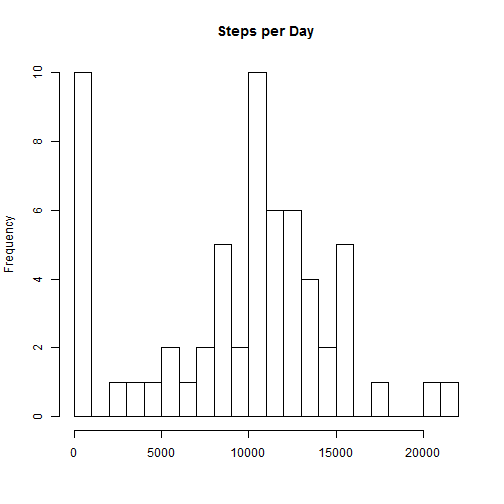
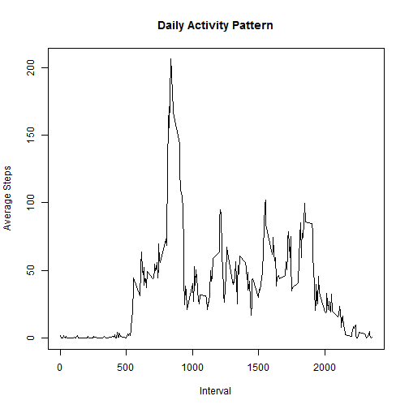
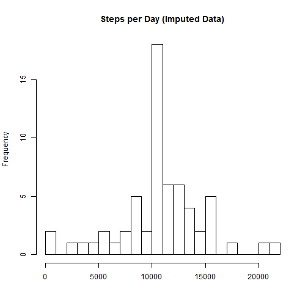

# Reproducible Research: Peer Assessment 1


## Loading and preprocessing the data
The data file *activity.csv* is stored in the same folder as this file.

```r
activity<-read.csv("activity.csv")
activity<-transform(activity,date=as.Date(date))
```
## What is mean total number of steps taken per day?
### Make a histogram of the total number of steps taken each day

```r
bydate<-sapply(split(activity$steps,as.factor(activity$date)),function(x)
        {sum(x,na.rm=T)})
hist(bydate,breaks=20,main="Steps per Day",xlab=NULL)
```

 
### Calculate and report the **mean** and **median** total number of steps  taken per day

```r
steps_mean<-round(mean(bydate))
steps_median<-median(bydate)
```
The mean total number of steps per day is 9354, and the 
median total number of steps per day is 10395.

## What is the average daily activity pattern?

```r
computpattern<-function(data){
        sapply(split(data$steps,data$interval), function(x){
        mean(x,na.rm=T)})
        }
byinterval=computpattern(activity)
plot(as.numeric(names(byinterval)),byinterval,type="l",lwd=1,xlab="Interval",
     ylab="Average Steps",main="Daily Activity Pattern")
```

 

```r
interval_max<-names(which.max(byinterval))
```

The interval 835 contains the maximum number of average steps. 

## Imputing missing values
The dataset has total 2304 missing values.   

Try to impute the missing values by setting them equal to the mean values of
the steps for the corresponding intervals. 


```r
activity2<-activity
idx<-is.na(activity$steps)
imputed<-byinterval[as.character(activity$interval[idx])]
activity2$steps[idx]<-imputed
bydate2<-sapply(split(activity2$steps,as.factor(activity2$date)),function(x)
        {sum(x,na.rm=T)})
hist(bydate2,breaks=20,main="Steps per Day (Imputed Data)",xlab=NULL)
```

 

```r
steps_mean2<-round(mean(bydate2))
steps_median2<-median(bydate2)
```
The mean total number of steps per day is 1.0766 &times; 10<sup>4</sup>, the median   total number of steps per day is 1.0766 &times; 10<sup>4</sup>.   

Since we assume that the missing values equal the the mean values of the steps  
for the corresponding intervals, imputing these values causes an increase in 
the mean and median total numbers of steps per day and changes the pattern of  
the histogram. 

## Are there differences in activity patterns between weekdays and weekends?


```r
library(lattice)
WeekDays<-c("Monday", "Friday", "Thursday", "Tuesday","Wednesday")
activity$weekdays<-as.factor(ifelse(weekdays(activity$date) %in% WeekDays, 
                          "weekday","weekend"))
byweekdays<-lapply(split(activity,activity$weekdays),computpattern)
data_wd<-data.frame(interval=as.numeric(rep(names(byweekdays[[1]]),2)),
                    avg = c(byweekdays$weekday,byweekdays$weekend),
                    days = rep(c("weekday","weekend"),
                               each=length(byweekdays$weekday)))
with(data_wd,xyplot(avg~interval|days,type="l",layout=c(1,2),xlab="Interval",
                    ylab="Number of Steps"))
```

 

The pattern for weekdays seems to be different from that for weekends. 
